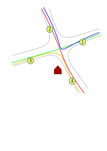

# local-buses
Tiny webapp UI to consume TfL bus arrival data to show all bus stops in area, combining them with the time to walk to that stop, to give an easily read list of buses and time before departure.

The problem this tries to fix is as follows. You live near four bus stops (1,2,3,4) which have four different services going to the same place (red,blue,green,orange).
The problem when catching a bus is: which bus stop do i walk to in order to catch the first bus to the place I want to go. Having to have four pages open to see each bus stop's timings, then adjust in your head for the distance to walk there is just a pain.

So, what this web UI does is take a set of bus stops and distances to walk to them as query parameters, then use data supplied via the TfL Open Data API, to give a departure-from-home board showing how long before you have to leave to get a bus in any particular direction or stop.

Stop Codes can be found from the page URLs of various various tfl.gov.uk sites, for example [490000254T](https://tfl.gov.uk/bus/stop/490000254T/waterloo-station/)

Then bookmark a link to the index.html page with query parameters `s=<stop code>!<time to get to stop>`, for example s=490000254T!5. These can be repeated to parse multiple stops.

The page will remove any duplicate buses if you can leave later and get the same bus - for instance it would not suggest you get the red bus from stop 2, because you generally could get it from stop 4 which is closer.

Visit an example at (https://michaelkaye.github.io/local-buses/?s=490000254T!2&s=490000254K!4)

